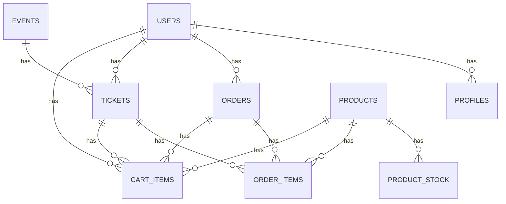

# Documentação Geral do Projeto Borboleta Eventos Loja

---

## 1. Informações do Projeto

- URL do projeto: https://lovable.dev/projects/fcdbda1c-4d21-4b6c-b263-d06022e73e05
- Requisitos: Node.js & npm
- Para rodar localmente:
  ```sh
  git clone <YOUR_GIT_URL>
  cd <YOUR_PROJECT_NAME>
  npm i
  npm run dev
  ```

---

## 2. Configuração da API do Abacate Pay

### Como configurar o token da API
1. Obtenha seu token no painel do Abacate Pay.
2. Copie `.env.example` para `.env.local` e configure:
   ```env
   VITE_ABACATE_PAY_TOKEN=seu_token_real_aqui
   ABACATE_PAY_API_KEY=seu_token_real_aqui
   ```
3. O sistema carrega automaticamente o token das variáveis de ambiente.

### Funcionalidades Implementadas
- Geração de QR Code PIX
- Verificação de pagamento via API
- Popup de pagamento com informações do cliente, empresa, valor, QR Code, status

### Teste do Sistema
- Checkout gera PIX via API
- Verificação automática do status do pagamento

---

## 3. Configuração para Produção (Supabase)

- Adicione a variável `ABACATE_PAY_API_KEY` no dashboard do Supabase em Settings → Environment Variables.
- Alternativamente, use a CLI:
  ```sh
  supabase secrets set ABACATE_PAY_API_KEY=sua_api_key_de_producao
  supabase secrets list
  ```

---

## 4. Autenticação Localhost

- Configure URLs de redirecionamento para localhost no Supabase.
- Exemplo de config:
  ```toml
  [auth]
  site_url = "http://localhost:8083"
  additional_redirect_urls = ["http://localhost:8083", "http://127.0.0.1:8083"]
  ```
- Reinicie o Supabase local após alterações.

---

## 5. Diagrama Relacional (ERD)


Cole este código em um visualizador Mermaid para gerar o diagrama visual.

---

## 6. Navegação e Configuração no Supabase

- Dashboard: https://supabase.com/dashboard/project/pxcvoiffnandpdyotped
- Adicione variáveis de ambiente conforme instruções acima.
- Reinicie funções Edge se necessário após alterar secrets.

---

## 7. Solução Rápida para Auth

- Se login redirecionar para produção, ajuste URLs conforme acima.
- Teste login e checkout em http://localhost:8083

---

## 8. Observações Finais

- Sempre mantenha as variáveis de ambiente seguras e fora do controle de versão.
- Consulte a documentação oficial do Supabase e Abacate Pay para detalhes avançados.
- Para dúvidas, consulte este arquivo ou os links diretos do dashboard.

---

# Fim da Documentação Geral
