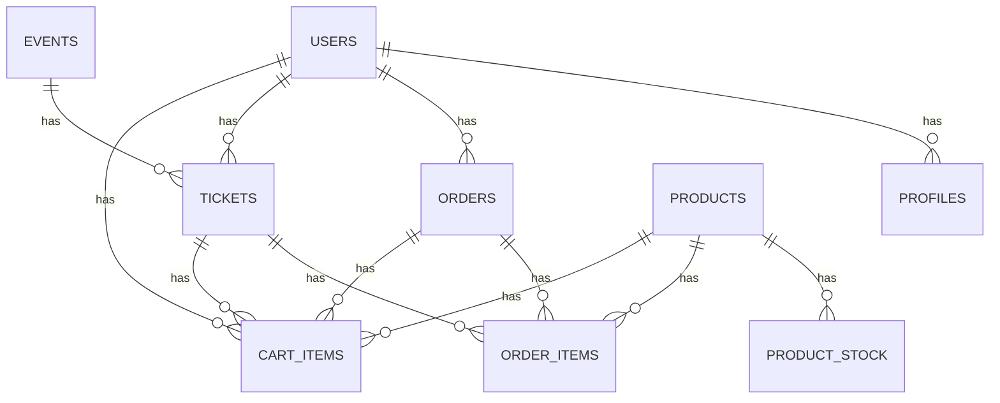

# Esquema Relacional (ERD) - Borboleta Eventos Loja

```mermaid
erDiagram
  USERS ||--o{ PROFILES : "has"
  USERS ||--o{ ORDERS : "has"
  USERS ||--o{ TICKETS : "has"
  USERS ||--o{ CART_ITEMS : "has"
  EVENTS ||--o{ TICKETS : "has"
  PRODUCTS ||--o{ PRODUCT_STOCK : "has"
  PRODUCTS ||--o{ ORDER_ITEMS : "has"
  PRODUCTS ||--o{ CART_ITEMS : "has"
  ORDERS ||--o{ ORDER_ITEMS : "has"
  ORDERS ||--o{ CART_ITEMS : "has"
  TICKETS ||--o{ ORDER_ITEMS : "has"
  TICKETS ||--o{ CART_ITEMS : "has"
```

Cole este código em um visualizador Mermaid (ex: https://mermaid.live/) para gerar o diagrama visual. 