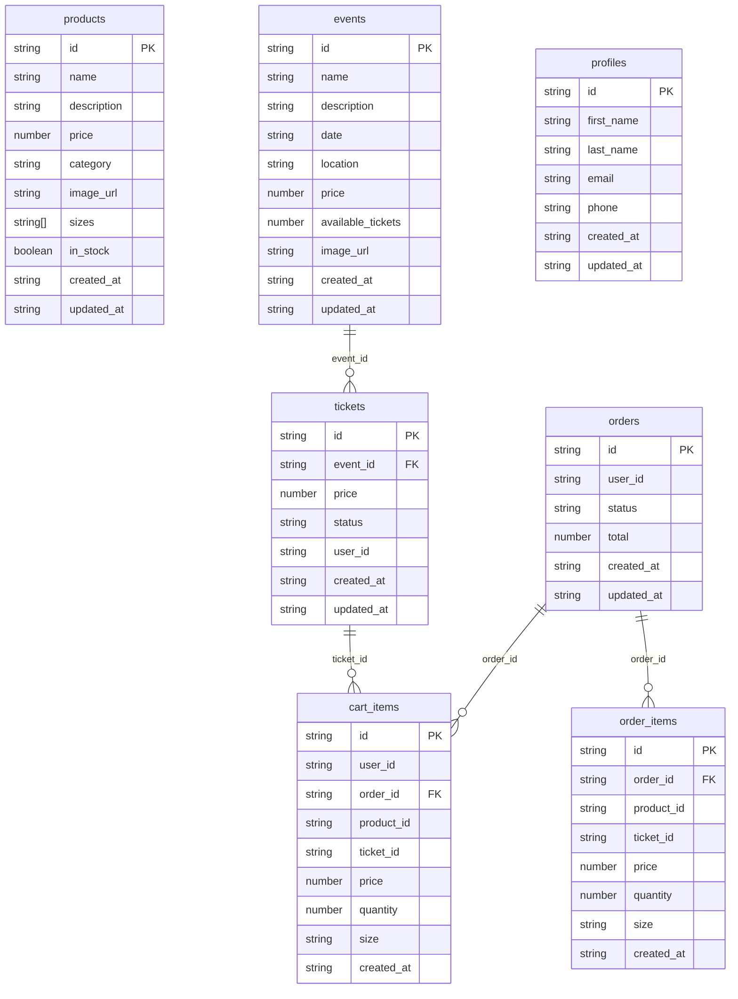

# Esquema Relacional do Banco de Dados (ERD)

```mermaid
erDiagram
  products {
    string id PK
    string name
    string description
    number price
    string category
    string image_url
    string[] sizes
    boolean in_stock
    string created_at
    string updated_at
  }
  events {
    string id PK
    string name
    string description
    string date
    string location
    number price
    number available_tickets
    string image_url
    string created_at
    string updated_at
  }
  tickets {
    string id PK
    string event_id FK
    number price
    string status
    string user_id
    string created_at
    string updated_at
  }
  profiles {
    string id PK
    string first_name
    string last_name
    string email
    string phone
    string created_at
    string updated_at
  }
  orders {
    string id PK
    string user_id
    string status
    number total
    string created_at
    string updated_at
  }
  order_items {
    string id PK
    string order_id FK
    string product_id
    string ticket_id
    number price
    number quantity
    string size
    string created_at
  }
  cart_items {
    string id PK
    string user_id
    string order_id FK
    string product_id
    string ticket_id
    number price
    number quantity
    string size
    string created_at
  }
  events ||--o{ tickets : event_id
  orders ||--o{ order_items : order_id
  orders ||--o{ cart_items : order_id
  tickets ||--o{ cart_items : ticket_id
```

> Visualize este diagrama em editores compatíveis com Mermaid, como o VSCode com extensão Mermaid ou no site mermaid.live. 