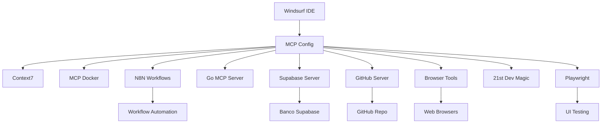

# 🚀 MCP Setup - Configuração Completa

## 📋 Visão Geral

Este documento explica como configurar e usar o Model Context Protocol (MCP) dentro do ambiente Docker do projeto Borboleta Eventos. O MCP permite integração avançada com serviços como Supabase, GitHub e outros através de containers Docker.

## 🔧 Configuração Atual - Arquitetura Centralizada

### Arquivo de Configuração MCP

O arquivo `mcp_config.json` está localizado na raiz do projeto e contém **APENAS** o servidor MCP_DOCKER principal que orquestra todos os demais:

```json
{
    "servers": {
        "MCP_DOCKER": {
            "command": "docker",
            "args": ["exec", "-i", "borboleta-eventos-loja-app-1", "bash", "-c", "npx mcp-orchestrator"],
            "env": {
                "DOCKER_HOST": "tcp://host.docker.internal:8811",
                "MCP_CONTEXT7_ENABLED": "true",
                "MCP_N8N_ENABLED": "true", 
                "MCP_GO_ENABLED": "true",
                "MCP_SUPABASE_ENABLED": "true",
                "MCP_GITHUB_ENABLED": "true",
                "MCP_BROWSER_ENABLED": "true",
                "MCP_MAGIC_ENABLED": "true",
                "MCP_PLAYWRIGHT_ENABLED": "true",
                "SUPABASE_URL": "https://pxcvoiffnandpdyotped.supabase.co",
                "SUPABASE_ANON_KEY": "eyJhbGciOiJIUzI1NiIs...",
                "GITHUB_PERSONAL_ACCESS_TOKEN": "",
                "N8N_API_URL": "http://localhost:5678"
            }
        }
    }
}
```

### 🏗️ **Arquitetura Centralizada**

**Windsurf IDE** → **MCP_DOCKER** → **Orchestrator** → **8 Servidores MCP**

1. **Windsurf** conecta apenas ao **MCP_DOCKER**
2. **MCP_DOCKER** executa o **mcp-orchestrator.js** dentro do container
3. **Orchestrator** inicia e gerencia todos os 8 servidores MCP internamente
4. **Comunicação unificada** através de um único ponto de entrada

## 🚀 Servidores MCP Configurados

### 1. CONTEXT7
- **Propósito**: Gerenciamento de contexto com Upstash
- **Comando**: `npx -y @upstash/context7-mcp@latest`
- **Funcionalidade**: Context management avançado

### 2. MCP_DOCKER
- **Propósito**: Comunicação básica com Docker via socat
- **Porta**: 8811 (host.docker.internal)
- **Funcionalidade**: Permite comunicação entre o MCP e containers Docker

### 3. N8N-MCP
- **Propósito**: Automação de workflows
- **URL**: http://localhost:5678
- **Funcionalidades**:
  - Automação de processos
  - Integração de serviços
  - Workflows customizados

### 4. GO-MCP
- **Propósito**: Servidor MCP em Go
- **Comando**: `go-mcp-server`
- **Funcionalidade**: Performance otimizada para operações específicas

### 5. SUPABASE
- **Propósito**: Integração oficial com Supabase
- **Servidor**: @modelcontextprotocol/server-supabase
- **Funcionalidades**:
  - Consultas em tempo real ao banco
  - Operações CRUD automáticas
  - Monitoramento de dados
  - Sincronização de estado
  - Gerenciamento de API keys
  - Configuração de auth

### 6. GITHUB
- **Propósito**: Integração oficial com GitHub
- **Servidor**: @modelcontextprotocol/server-github
- **Funcionalidades**:
  - Gerenciamento de código
  - Pull requests automáticos
  - Sincronização de issues
  - Deploy automático

### 7. BROWSER-TOOLS
- **Propósito**: Automação de browser
- **Servidor**: @modelcontextprotocol/server-browser
- **Funcionalidades**:
  - Automação web
  - Scraping de dados
  - Testes de interface

### 8. 21ST-DEV-MAGIC
- **Propósito**: Ferramentas de desenvolvimento
- **Servidor**: @21st-dev/magic-mcp@latest
- **Funcionalidades**:
  - Utilitários de desenvolvimento
  - Automação de tarefas
  - Ferramentas de produtividade

### 9. PLAYWRIGHT
- **Propósito**: Testes e automação web
- **Servidor**: playwright-mcp-server
- **Funcionalidades**:
  - Testes automatizados
  - Automação de UI
  - Cross-browser testing

## 🔄 Como Funciona

### Fluxo de Comunicação



### Processo de Execução

1. **Inicialização**: Windsurf lê o arquivo `mcp_config.json`
2. **Servidores**: Inicia todos os 9 servidores MCP configurados
3. **Conexões**: Estabelece canais de comunicação com cada serviço
4. **Integração**: Permite acesso unificado a todas as ferramentas

## 🛠️ Ferramentas MCP Supabase Disponíveis

### 🏢 **Gerenciamento de Projetos**
- `SUPABASE_LIST_ALL_PROJECTS` - Lista todos os projetos
- `SUPABASE_LIST_ALL_ORGANIZATIONS` - Lista organizações
- `SUPABASE_CREATE_A_PROJECT` - Cria novo projeto

### 🔐 **Autenticação e API**
- `SUPABASE_GET_PROJECT_API_KEYS` - Lista API keys
- `SUPABASE_ALPHA_CREATES_A_NEW_API_KEY_FOR_THE_PROJECT` - Cria API key
- `SUPABASE_GETS_PROJECT_S_AUTH_CONFIG` - Configuração auth
- `SUPABASE_CREATES_A_NEW_THIRD_PARTY_AUTH_INTEGRATION` - Auth terceiros

### 🗄️ **Banco de Dados**
- `SUPABASE_BETA_RUN_SQL_QUERY` - Executa SQL queries
- `SUPABASE_GETS_PROJECT_S_POSTGRES_CONFIG` - Config PostgreSQL
- `SUPABASE_LISTS_ALL_BACKUPS` - Lista backups
- `SUPABASE_GENERATE_TYPE_SCRIPT_TYPES` - Gera tipos TS

### 📁 **Storage e Functions**
- `SUPABASE_LISTS_ALL_BUCKETS` - Lista buckets
- `SUPABASE_LIST_ALL_FUNCTIONS` - Lista edge functions
- `SUPABASE_CREATE_A_FUNCTION` - Cria nova function

### 📊 **Monitoramento**
- `SUPABASE_GETS_PROJECT_S_SERVICE_HEALTH_STATUS` - Status saúde

**Projeto Ativo**: `queren` (pxcvoiffnandpdyotped) - ACTIVE_HEALTHY ✅

## 🛠 Instalação e Setup

### 🪟 **Windows (Recomendado)**

```powershell
# 1. Execute o script de setup automático
.\setup-mcp-windows.ps1
```

### 🐧 **Linux/Mac Manual**

```bash
# 1. Construir e iniciar container
docker-compose up --build -d

# 2. Executar setup dentro do container
docker exec borboleta-eventos-loja-app-1 bash /app/scripts/setup-mcp.sh

# 3. Verificar instalação
docker exec borboleta-eventos-loja-app-1 bash /app/scripts/verify-mcp.sh
```

### Pré-requisitos

```bash
# Docker deve estar rodando
docker ps

# Container da aplicação deve estar ativo
docker ps | grep borboleta-eventos-loja-app-1
```

### Verificação do Ambiente

```bash
# Verificar se o container está rodando
docker exec borboleta-eventos-loja-app-1 node --version

# Testar conectividade Supabase
docker exec borboleta-eventos-loja-app-1 npm run test:supabase
```

## 🔐 Configuração de Segurança

### Variáveis de Ambiente

As credenciais são gerenciadas através de variáveis de ambiente dentro do container via `docker-compose.yml`:

```yaml
environment:
  # Configurações MCP
  - MCP_CONTEXT7_ENABLED=true
  - MCP_N8N_ENABLED=true
  - MCP_GO_ENABLED=true
  - MCP_SUPABASE_ENABLED=true
  - MCP_GITHUB_ENABLED=true
  - MCP_BROWSER_ENABLED=true
  - MCP_MAGIC_ENABLED=true
  - MCP_PLAYWRIGHT_ENABLED=true
  # Credenciais dos serviços
  - SUPABASE_URL=https://pxcvoiffnandpdyotped.supabase.co
  - SUPABASE_ANON_KEY=${SUPABASE_ANON_KEY}
  - GITHUB_PERSONAL_ACCESS_TOKEN=${GITHUB_PERSONAL_ACCESS_TOKEN}
  - N8N_API_URL=http://localhost:5678
  - DOCKER_HOST=tcp://host.docker.internal:8811
```

### Arquivo .env.local

```bash
# Copie .env.example para .env.local e configure:
cp .env.example .env.local

# Configure suas credenciais:
# - GITHUB_PERSONAL_ACCESS_TOKEN
# - Outras credenciais específicas
```

## 📊 Uso e Comandos

### Comandos NPM Disponíveis

```bash
# Iniciar MCP Orchestrator
npm run mcp:start

# Verificar instalação MCP
npm run mcp:verify

# Executar setup MCP
npm run mcp:setup

# Verificar status dos processos
npm run mcp:status
```

### Comandos Docker Diretos

```bash
# Iniciar MCP Orchestrator
docker exec -it borboleta-eventos-loja-app-1 npx mcp-orchestrator

# Verificar logs
docker-compose logs -f app

# Conectar ao container
docker exec -it borboleta-eventos-loja-app-1 bash
```

## 📊 Monitoramento e Logs

### Logs dos Servidores MCP

```bash
# Logs do MCP Supabase
docker exec borboleta-eventos-loja-app-1 npx @modelcontextprotocol/server-supabase --verbose

# Logs do MCP GitHub
docker exec borboleta-eventos-loja-app-1 npx @modelcontextprotocol/server-github --debug
```

### Diagnóstico de Conectividade

```bash
# Testar conexão Supabase
docker exec borboleta-eventos-loja-app-1 node -e "
const { createClient } = require('@supabase/supabase-js');
const client = createClient('https://pxcvoiffnandpdyotped.supabase.co', 'eyJhbGciOiJIUzI1NiIsInR5cCI6IkpXVCJ9...');
client.from('products').select('*').limit(1).then(console.log);
"
```

## 🚨 Troubleshooting

### Problemas Comuns

#### 1. Container não encontrado
```bash
# Verificar se o container está rodando
docker ps -a | grep borboleta

# Iniciar container se necessário
docker-compose up -d
```

#### 2. Erro de permissão MCP
```bash
# Verificar permissões do container
docker exec borboleta-eventos-loja-app-1 whoami
docker exec borboleta-eventos-loja-app-1 ls -la /app
```

#### 3. Falha na conexão Supabase
```bash
# Testar conectividade manual
docker exec borboleta-eventos-loja-app-1 curl -I https://pxcvoiffnandpdyotped.supabase.co
```

#### 4. Servidor MCP não responde
```bash
# Reinstalar servidores MCP
docker exec borboleta-eventos-loja-app-1 npm uninstall -g @modelcontextprotocol/server-supabase
docker exec borboleta-eventos-loja-app-1 npm install -g @modelcontextprotocol/server-supabase@latest
```

#### 5. Windsurf não conecta ao MCP
```bash
# Verificar se o arquivo de configuração está correto
# Windows: C:\Users\{username}\.codeium\windsurf\mcp_config.json
# Mac/Linux: ~/.codeium/windsurf/mcp_config.json

# Copiar configuração do projeto
cp mcp_config.json ~/.codeium/windsurf/mcp_config.json
```

### Logs de Debug

```bash
# Habilitar debug mode
export MCP_DEBUG=1

# Logs detalhados do Docker
docker-compose logs -f app

# Logs específicos do orchestrator
docker exec borboleta-eventos-loja-app-1 npx mcp-orchestrator --verbose
```

## 📈 Otimizações

### Performance

- Use cache de conexões MCP
- Implemente connection pooling
- Configure timeouts apropriados

### Segurança

- Rotacione tokens regularmente
- Use secrets do Docker
- Implemente rate limiting

## 🔄 Comandos Úteis

```bash
# Reiniciar serviços MCP
docker exec borboleta-eventos-loja-app-1 pkill -f mcp-server
docker-compose restart app

# Atualizar configuração MCP
# Edite mcp_config.json e reinicie o Windsurf

# Status dos serviços
docker exec borboleta-eventos-loja-app-1 ps aux | grep mcp

# Teste de integração completo
docker exec borboleta-eventos-loja-app-1 npm run test:supabase

# Rebuild completo
docker-compose down
docker-compose up --build -d
```

## 🗂️ Estrutura de Arquivos

```
borboleta-eventos-loja/
├── mcp_config.json              # Configuração principal MCP
├── setup-mcp-windows.ps1        # Script setup Windows
├── .env.example                 # Template variáveis ambiente
├── docker-compose.yml           # Configuração Docker com MCP
├── Dockerfile                   # Imagem com servidores MCP
├── scripts/
│   ├── mcp-orchestrator.js      # Orquestrador principal ⭐
│   ├── setup-mcp.sh            # Setup Linux/Mac
│   └── verify-mcp.sh           # Verificação instalação
└── package.json                # Scripts NPM para MCP
```

## 📝 Notas Importantes

1. **Container Principal**: Todos os serviços MCP rodam dentro do container `borboleta-eventos-loja-app-1`
2. **Persistência**: Configurações MCP são mantidas no projeto e copiadas para o Windsurf
3. **Rede**: Comunicação usa `host.docker.internal` para conectividade entre host e container
4. **Logs**: Todos os logs MCP são redirecionados para stdout do container
5. **Configuração Windsurf**: O arquivo `mcp_config.json` deve ser copiado para `~/.codeium/windsurf/`

## 🆘 Suporte

Em caso de problemas:

1. Verifique se o Docker está rodando
2. Confirme que o container está ativo
3. Execute o script de verificação
4. Teste conectividade com Supabase
5. Verifique logs do container
6. Consulte este documento para troubleshooting

### Scripts de Diagnóstico Rápido

```bash
# Windows
.\setup-mcp-windows.ps1

# Linux/Mac  
docker exec borboleta-eventos-loja-app-1 bash /app/scripts/verify-mcp.sh

# Status geral
docker exec borboleta-eventos-loja-app-1 npm run mcp:status
```

---

*Documentação atualizada em: Agosto 2025*
*Versão do Docker: 20.x+*
*Versão do MCP: Latest*
*Versão do Node: 20.x+*
