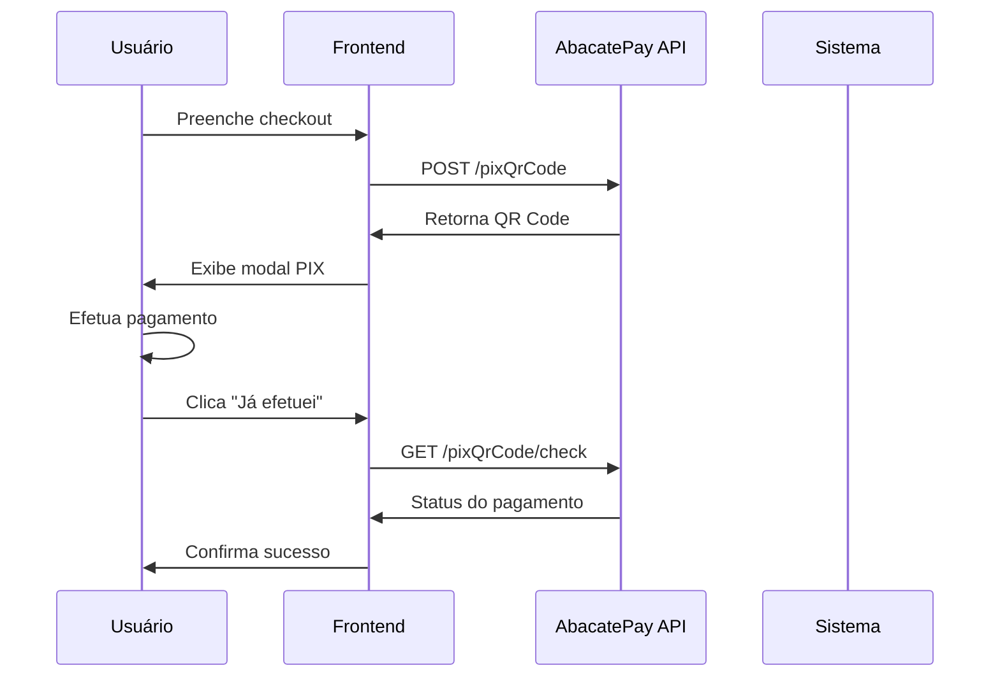

# 🔧 AbacatePay SDK - Guia Técnico Avançado

## 📋 Sumário

- [Arquitetura da Integração](#arquitetura-da-integração)
- [Tipos TypeScript](#tipos-typescript)
- [Configuração Avançada](#configuração-avançada)
- [Testes e Validação](#testes-e-validação)
- [Monitoramento e Logs](#monitoramento-e-logs)
- [Performance e Otimização](#performance-e-otimização)

---

## 🏗 Arquitetura da Integração

### Fluxo de Pagamento



### Estrutura de Componentes

```
PaymentFlow/
├── PaymentPopup.tsx        # Modal principal
├── QRCodeDisplay.tsx       # Exibição do QR Code
├── PaymentInfo.tsx         # Informações do pagamento
├── CopyPixCode.tsx         # Botão copiar código PIX
└── PaymentStatus.tsx       # Status e verificação
```

---

## 🎯 Tipos TypeScript

### Interfaces Principais

```typescript
// src/types/abacatePay.ts

export interface PixPaymentRequest {
  amount: number;              // Valor em centavos
  description: string;         // Descrição do pagamento
  externalId: string;         // ID único do pedido
  customer: CustomerData;
  expiresAt?: string;         // Data de expiração
}

export interface CustomerData {
  name: string;
  email: string;
  phone?: string;
  document?: string;
}

export interface PixPaymentResponse {
  id: string;                 // ID da transação
  qrCode: string;            // Código PIX copia e cola
  qrCodeBase64: string;      // QR Code em base64
  expiresAt: string;         // Data de expiração ISO
  amount: number;            // Valor em centavos
  status: PaymentStatus;
  customer: CustomerData;
}

export type PaymentStatus = 
  | 'PENDING'
  | 'APPROVED' 
  | 'REJECTED'
  | 'EXPIRED'
  | 'CANCELLED';

export interface PaymentCheckResponse {
  id: string;
  status: PaymentStatus;
  paidAt?: string;           // Data do pagamento ISO
  approvedAt?: string;       // Data de aprovação ISO
}

export interface ApiError {
  error: string;
  message: string;
  statusCode: number;
}
```

### Hooks Customizados

```typescript
// src/hooks/useAbacatePayment.ts

import { useState, useCallback } from 'react';
import { ABACATE_PAY_CONFIG, getAuthHeaders } from '../config/abacatePay';

export const useAbacatePayment = () => {
  const [loading, setLoading] = useState(false);
  const [error, setError] = useState<string | null>(null);

  const createPixPayment = useCallback(async (data: PixPaymentRequest): Promise<PixPaymentResponse | null> => {
    setLoading(true);
    setError(null);

    try {
      const response = await fetch(`${ABACATE_PAY_CONFIG.baseUrl}${ABACATE_PAY_CONFIG.endpoints.createPixQrCode}`, {
        method: 'POST',
        headers: getAuthHeaders(),
        body: JSON.stringify(data)
      });

      if (!response.ok) {
        const errorData: ApiError = await response.json();
        throw new Error(errorData.message || 'Erro ao criar pagamento');
      }

      const result: PixPaymentResponse = await response.json();
      return result;
    } catch (err) {
      const errorMessage = err instanceof Error ? err.message : 'Erro desconhecido';
      setError(errorMessage);
      console.error('Erro ao criar pagamento PIX:', err);
      return null;
    } finally {
      setLoading(false);
    }
  }, []);

  const checkPaymentStatus = useCallback(async (transactionId: string): Promise<PaymentCheckResponse | null> => {
    try {
      const response = await fetch(
        `${ABACATE_PAY_CONFIG.baseUrl}${ABACATE_PAY_CONFIG.endpoints.checkPayment}?id=${transactionId}`,
        {
          method: 'GET',
          headers: getAuthHeaders()
        }
      );

      if (!response.ok) {
        throw new Error('Erro ao verificar pagamento');
      }

      const result: PaymentCheckResponse = await response.json();
      return result;
    } catch (err) {
      console.error('Erro ao verificar pagamento:', err);
      return null;
    }
  }, []);

  return {
    createPixPayment,
    checkPaymentStatus,
    loading,
    error
  };
};
```

---

## ⚙️ Configuração Avançada

### Configuração por Ambiente

```typescript
// src/config/abacatePay.ts

interface AbacateConfig {
  baseUrl: string;
  token: string;
  endpoints: {
    createPixQrCode: string;
    checkPayment: string;
  };
  timeout: number;
  retryAttempts: number;
}

const getEnvironmentConfig = (): Partial<AbacateConfig> => {
  const env = import.meta.env.VITE_ABACATE_PAY_ENV || 'development';
  
  switch (env) {
    case 'production':
      return {
        baseUrl: 'https://api.abacatepay.com/v1',
        timeout: 10000,
        retryAttempts: 3
      };
    case 'staging':
      return {
        baseUrl: 'https://staging-api.abacatepay.com/v1',
        timeout: 15000,
        retryAttempts: 2
      };
    default:
      return {
        baseUrl: 'https://api.abacatepay.com/v1',
        timeout: 20000,
        retryAttempts: 1
      };
  }
};

export const ABACATE_PAY_CONFIG: AbacateConfig = {
  token: import.meta.env.VITE_ABACATE_PAY_TOKEN || '',
  endpoints: {
    createPixQrCode: '/pixQrCode',
    checkPayment: '/pixQrCode/check'
  },
  ...getEnvironmentConfig()
};
```

### Headers Avançados

```typescript
export const getAuthHeaders = (additionalHeaders?: Record<string, string>) => {
  const token = ABACATE_PAY_CONFIG.token;
  
  if (!token) {
    throw new Error('Token da API do Abacate Pay não configurado');
  }
  
  return {
    'Authorization': `Bearer ${token}`,
    'Content-Type': 'application/json',
    'User-Agent': 'BorboletaEventos/1.0',
    'Accept': 'application/json',
    'X-API-Version': 'v1',
    ...additionalHeaders
  };
};
```

---

## 🧪 Testes e Validação

### Testes Unitários

```typescript
// src/tests/abacatePay.test.ts

import { describe, it, expect, vi, beforeEach } from 'vitest';
import { ABACATE_PAY_CONFIG, getAuthHeaders } from '../config/abacatePay';

describe('AbacatePay Configuration', () => {
  beforeEach(() => {
    vi.clearAllMocks();
  });

  it('should throw error when token is not configured', () => {
    // Mock empty token
    vi.stubEnv('VITE_ABACATE_PAY_TOKEN', '');
    
    expect(() => getAuthHeaders()).toThrow('Token da API do Abacate Pay não configurado');
  });

  it('should return correct headers when token is configured', () => {
    vi.stubEnv('VITE_ABACATE_PAY_TOKEN', 'test-token');
    
    const headers = getAuthHeaders();
    
    expect(headers).toEqual({
      'Authorization': 'Bearer test-token',
      'Content-Type': 'application/json',
      'User-Agent': 'BorboletaEventos/1.0',
      'Accept': 'application/json',
      'X-API-Version': 'v1'
    });
  });
});
```

### Validação de Dados

```typescript
// src/utils/validation.ts

export const validatePixPaymentRequest = (data: PixPaymentRequest): string[] => {
  const errors: string[] = [];

  if (!data.amount || data.amount <= 0) {
    errors.push('Valor deve ser maior que zero');
  }

  if (data.amount > 1000000) { // R$ 10.000,00
    errors.push('Valor máximo excedido');
  }

  if (!data.description || data.description.trim().length < 3) {
    errors.push('Descrição deve ter pelo menos 3 caracteres');
  }

  if (!data.customer.name || data.customer.name.trim().length < 2) {
    errors.push('Nome do cliente inválido');
  }

  if (!data.customer.email || !isValidEmail(data.customer.email)) {
    errors.push('Email inválido');
  }

  return errors;
};

const isValidEmail = (email: string): boolean => {
  const emailRegex = /^[^\s@]+@[^\s@]+\.[^\s@]+$/;
  return emailRegex.test(email);
};
```

---

## 📊 Monitoramento e Logs

### Sistema de Logs

```typescript
// src/utils/logger.ts

enum LogLevel {
  DEBUG = 0,
  INFO = 1,
  WARN = 2,
  ERROR = 3
}

class Logger {
  private level: LogLevel;

  constructor() {
    const debugMode = import.meta.env.VITE_DEBUG_ABACATE === 'true';
    this.level = debugMode ? LogLevel.DEBUG : LogLevel.INFO;
  }

  debug(message: string, data?: any) {
    if (this.level <= LogLevel.DEBUG) {
      console.debug(`[ABACATE-DEBUG] ${message}`, data);
    }
  }

  info(message: string, data?: any) {
    if (this.level <= LogLevel.INFO) {
      console.info(`[ABACATE-INFO] ${message}`, data);
    }
  }

  warn(message: string, data?: any) {
    if (this.level <= LogLevel.WARN) {
      console.warn(`[ABACATE-WARN] ${message}`, data);
    }
  }

  error(message: string, data?: any) {
    if (this.level <= LogLevel.ERROR) {
      console.error(`[ABACATE-ERROR] ${message}`, data);
    }
  }
}

export const logger = new Logger();
```

### Métricas e Analytics

```typescript
// src/utils/analytics.ts

interface PaymentMetrics {
  pixCreated: number;
  pixApproved: number;
  pixRejected: number;
  pixExpired: number;
  averagePaymentTime: number;
}

class PaymentAnalytics {
  private metrics: PaymentMetrics = {
    pixCreated: 0,
    pixApproved: 0,
    pixRejected: 0,
    pixExpired: 0,
    averagePaymentTime: 0
  };

  trackPixCreated(amount: number) {
    this.metrics.pixCreated++;
    logger.info('PIX criado', { amount, total: this.metrics.pixCreated });
  }

  trackPixApproved(paymentTime: number) {
    this.metrics.pixApproved++;
    this.updateAveragePaymentTime(paymentTime);
    logger.info('PIX aprovado', { paymentTime, total: this.metrics.pixApproved });
  }

  private updateAveragePaymentTime(newTime: number) {
    const total = this.metrics.pixApproved;
    this.metrics.averagePaymentTime = 
      (this.metrics.averagePaymentTime * (total - 1) + newTime) / total;
  }

  getMetrics(): PaymentMetrics {
    return { ...this.metrics };
  }
}

export const analytics = new PaymentAnalytics();
```

---

## ⚡ Performance e Otimização

### Cache de Requests

```typescript
// src/utils/cache.ts

interface CacheItem<T> {
  data: T;
  timestamp: number;
  ttl: number;
}

class RequestCache {
  private cache = new Map<string, CacheItem<any>>();

  set<T>(key: string, data: T, ttl: number = 300000): void { // 5 minutos default
    this.cache.set(key, {
      data,
      timestamp: Date.now(),
      ttl
    });
  }

  get<T>(key: string): T | null {
    const item = this.cache.get(key);
    
    if (!item) return null;
    
    if (Date.now() - item.timestamp > item.ttl) {
      this.cache.delete(key);
      return null;
    }
    
    return item.data;
  }

  clear(): void {
    this.cache.clear();
  }
}

export const requestCache = new RequestCache();
```

### Retry Logic

```typescript
// src/utils/retry.ts

interface RetryOptions {
  maxAttempts: number;
  delay: number;
  backoff: boolean;
}

export async function withRetry<T>(
  fn: () => Promise<T>,
  options: RetryOptions = { maxAttempts: 3, delay: 1000, backoff: true }
): Promise<T> {
  let attempt = 1;
  
  while (attempt <= options.maxAttempts) {
    try {
      return await fn();
    } catch (error) {
      if (attempt === options.maxAttempts) {
        throw error;
      }
      
      const delay = options.backoff 
        ? options.delay * Math.pow(2, attempt - 1)
        : options.delay;
      
      logger.warn(`Tentativa ${attempt} falhou, retry em ${delay}ms`, error);
      
      await new Promise(resolve => setTimeout(resolve, delay));
      attempt++;
    }
  }
  
  throw new Error('Máximo de tentativas excedido');
}
```

### Debounce para Verificação de Pagamento

```typescript
// src/hooks/usePaymentPolling.ts

import { useCallback, useRef } from 'react';

export const usePaymentPolling = () => {
  const pollingRef = useRef<NodeJS.Timeout>();

  const startPolling = useCallback((
    transactionId: string,
    onStatusChange: (status: PaymentStatus) => void,
    interval: number = 5000
  ) => {
    if (pollingRef.current) {
      clearInterval(pollingRef.current);
    }

    pollingRef.current = setInterval(async () => {
      try {
        const response = await fetch(
          `${ABACATE_PAY_CONFIG.baseUrl}${ABACATE_PAY_CONFIG.endpoints.checkPayment}?id=${transactionId}`,
          { headers: getAuthHeaders() }
        );
        
        const result = await response.json();
        
        if (result.status === 'APPROVED' || result.status === 'REJECTED') {
          stopPolling();
          onStatusChange(result.status);
        }
      } catch (error) {
        logger.error('Erro no polling de pagamento', error);
      }
    }, interval);
  }, []);

  const stopPolling = useCallback(() => {
    if (pollingRef.current) {
      clearInterval(pollingRef.current);
      pollingRef.current = undefined;
    }
  }, []);

  return { startPolling, stopPolling };
};
```

---

## 🔐 Segurança Avançada

### Rate Limiting

```typescript
// src/utils/rateLimiter.ts

class RateLimiter {
  private requests = new Map<string, number[]>();

  canMakeRequest(endpoint: string, limit: number = 10, windowMs: number = 60000): boolean {
    const now = Date.now();
    const windowStart = now - windowMs;
    
    if (!this.requests.has(endpoint)) {
      this.requests.set(endpoint, []);
    }
    
    const endpointRequests = this.requests.get(endpoint)!;
    
    // Remove requests outside the window
    const validRequests = endpointRequests.filter(time => time > windowStart);
    this.requests.set(endpoint, validRequests);
    
    if (validRequests.length >= limit) {
      return false;
    }
    
    validRequests.push(now);
    return true;
  }
}

export const rateLimiter = new RateLimiter();
```

### Sanitização de Dados

```typescript
// src/utils/sanitizer.ts

export const sanitizeCustomerData = (data: CustomerData): CustomerData => {
  return {
    name: sanitizeString(data.name),
    email: sanitizeEmail(data.email),
    phone: data.phone ? sanitizePhone(data.phone) : undefined,
    document: data.document ? sanitizeDocument(data.document) : undefined
  };
};

const sanitizeString = (str: string): string => {
  return str.trim().replace(/[<>]/g, '');
};

const sanitizeEmail = (email: string): string => {
  return email.toLowerCase().trim();
};

const sanitizePhone = (phone: string): string => {
  return phone.replace(/\D/g, '');
};

const sanitizeDocument = (document: string): string => {
  return document.replace(/\D/g, '');
};
```

---

## 📱 Responsividade e Acessibilidade

### Media Queries

```css
/* src/styles/payment-popup.css */

.payment-popup {
  @media (max-width: 768px) {
    width: 95vw;
    height: 90vh;
    margin: 5vh auto;
  }
  
  @media (max-width: 480px) {
    width: 100vw;
    height: 100vh;
    margin: 0;
    border-radius: 0;
  }
}

.qr-code-container {
  @media (max-width: 480px) {
    max-width: 200px;
    max-height: 200px;
  }
}
```

### Acessibilidade (A11y)

```tsx
// Exemplo de implementação acessível

const PaymentPopup: React.FC<PaymentPopupProps> = ({ isOpen, onClose, pixData }) => {
  return (
    <div
      role="dialog"
      aria-modal="true"
      aria-labelledby="payment-title"
      aria-describedby="payment-description"
      className={`payment-popup ${isOpen ? 'open' : ''}`}
    >
      <h2 id="payment-title">Pagamento PIX</h2>
      <div id="payment-description">
        Complete seu pagamento escaneando o QR Code ou copiando o código PIX
      </div>
      
      <button
        onClick={onClose}
        aria-label="Fechar modal de pagamento"
        className="close-button"
      >
        ×
      </button>
      
      
      
      <button
        onClick={copyPixCode}
        aria-label="Copiar código PIX para área de transferência"
      >
        Copiar código PIX
      </button>
    </div>
  );
};
```

---

## 📈 Métricas de Negócio

### KPIs de Pagamento

```typescript
// src/utils/businessMetrics.ts

interface PaymentKPIs {
  conversionRate: number;      // Taxa de conversão
  averageTicket: number;       // Ticket médio
  paymentSuccess: number;      // Taxa de sucesso
  abandonmentRate: number;     // Taxa de abandono
}

class BusinessMetrics {
  calculateConversionRate(pixCreated: number, pixApproved: number): number {
    if (pixCreated === 0) return 0;
    return (pixApproved / pixCreated) * 100;
  }

  calculateAverageTicket(payments: { amount: number }[]): number {
    if (payments.length === 0) return 0;
    const total = payments.reduce((sum, payment) => sum + payment.amount, 0);
    return total / payments.length;
  }

  generateReport(): PaymentKPIs {
    const metrics = analytics.getMetrics();
    
    return {
      conversionRate: this.calculateConversionRate(metrics.pixCreated, metrics.pixApproved),
      averageTicket: 0, // Implementar baseado nos dados reais
      paymentSuccess: (metrics.pixApproved / (metrics.pixApproved + metrics.pixRejected)) * 100,
      abandonmentRate: (metrics.pixExpired / metrics.pixCreated) * 100
    };
  }
}

export const businessMetrics = new BusinessMetrics();
```

---

Esta documentação técnica avançada complementa a documentação principal e fornece todos os detalhes necessários para uma implementação robusta e profissional da integração AbacatePay.
