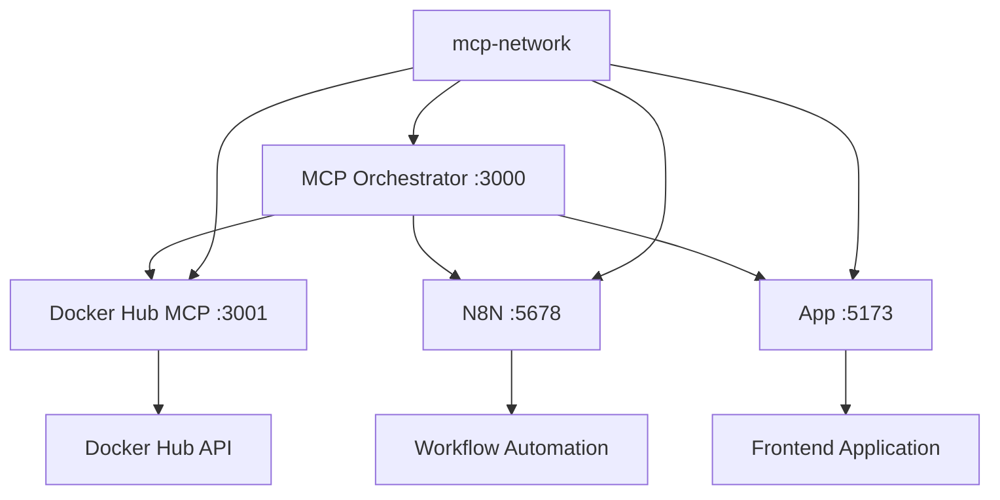

# 🚀 MCP Orchestrator Stack

Stack completa para desenvolvimento com MCP (Model Context Protocol) usando Docker Orchestrator, Docker Hub MCP, N8N e aplicação principal.

## 📋 Pré-requisitos

- Docker Desktop instalado e rodando
- PowerShell 5.0+ (Windows)
- Acesso à internet para pull das imagens
- Tokens de acesso configurados

## 🏗️ Arquitetura da Stack



### Serviços Incluídos

| Serviço | Porta | Descrição | Imagem |
|---------|-------|-----------|--------|
| **MCP Orchestrator** | 3000 | Orquestrador principal MCP | `mcp-orchestrator:latest` |
| **Docker Hub MCP** | 3001 | Interface MCP para Docker Hub | `mcp/dockerhub:latest` |
| **N8N** | 5678 | Automação de workflows | `n8nio/n8n:latest` |
| **App** | 5173 | Aplicação principal | Local build |

## 🚀 Início Rápido

### 1. Configuração do Ambiente

```powershell
# Copiar arquivo de configuração
cp .env.mcp.example .env.mcp

# Editar configurações
notepad .env.mcp
```

### 2. Configurar Tokens Necessários

#### Docker Hub Personal Access Token
1. Acesse [Docker Hub Security Settings](https://hub.docker.com/settings/security)
2. Clique em "New Access Token"
3. Configure:
   - **Description**: `MCP Orchestrator`
   - **Permissions**: `Public Repo Read`
4. Copie o token gerado para `HUB_PAT_TOKEN`

#### GitHub Personal Access Token
1. Acesse [GitHub Token Settings](https://github.com/settings/tokens)
2. Clique em "Generate new token (classic)"
3. Configure:
   - **Note**: `MCP Orchestrator`
   - **Scopes**: `repo`, `read:user`
4. Copie o token para `GITHUB_PERSONAL_ACCESS_TOKEN`

#### Supabase Configuration
1. Acesse seu projeto no [Supabase Dashboard](https://supabase.com/dashboard)
2. Vá em Settings > API
3. Copie:
   - **URL**: Para `VITE_SUPABASE_URL`
   - **anon public**: Para `VITE_SUPABASE_ANON_KEY`
   - **service_role**: Para `SUPABASE_SERVICE_ROLE_KEY`

### 3. Iniciar a Stack

```powershell
# Usando o script de gerenciamento
.\scripts\mcp-orchestrator-stack.ps1 -Action start

# Ou usando docker-compose diretamente
docker-compose -f docker-compose.mcp-orchestrator.yml up -d
```

## 🛠️ Gerenciamento da Stack

### Script de Gerenciamento

O script `scripts/mcp-orchestrator-stack.ps1` oferece comandos convenientes:

```powershell
# Iniciar stack
.\scripts\mcp-orchestrator-stack.ps1 -Action start

# Verificar status
.\scripts\mcp-orchestrator-stack.ps1 -Action status

# Ver logs em tempo real
.\scripts\mcp-orchestrator-stack.ps1 -Action logs

# Testar integração
.\scripts\mcp-orchestrator-stack.ps1 -Action test

# Reiniciar stack
.\scripts\mcp-orchestrator-stack.ps1 -Action restart

# Parar stack
.\scripts\mcp-orchestrator-stack.ps1 -Action stop

# Limpeza completa
.\scripts\mcp-orchestrator-stack.ps1 -Action clean
```

### Comandos Docker Compose Manuais

```powershell
# Iniciar em background
docker-compose -f docker-compose.mcp-orchestrator.yml up -d

# Ver logs
docker-compose -f docker-compose.mcp-orchestrator.yml logs -f

# Parar serviços
docker-compose -f docker-compose.mcp-orchestrator.yml down

# Rebuild e restart
docker-compose -f docker-compose.mcp-orchestrator.yml up -d --build
```

## 🌐 Acessando os Serviços

Após iniciar a stack, os serviços estarão disponíveis em:

- **MCP Orchestrator**: http://localhost:3000
- **Docker Hub MCP**: http://localhost:3001
- **N8N**: http://localhost:5678
  - Usuário: `admin`
  - Senha: `admin123`
- **App**: http://localhost:5173

## 🔧 Configuração Avançada

### Variáveis de Ambiente Importantes

```bash
# Docker Hub MCP
HUB_PAT_TOKEN=dckr_pat_xxxxx
DOCKER_HUB_USERNAME=seu_usuario

# Supabase
VITE_SUPABASE_URL=https://xxx.supabase.co
VITE_SUPABASE_ANON_KEY=eyJxxx
SUPABASE_SERVICE_ROLE_KEY=eyJxxx

# GitHub
GITHUB_PERSONAL_ACCESS_TOKEN=ghp_xxx

# N8N
N8N_BASIC_AUTH_ACTIVE=true
N8N_BASIC_AUTH_USER=admin
N8N_BASIC_AUTH_PASSWORD=admin123
```

### Customização de Portas

Se precisar alterar portas (conflitos), edite o `docker-compose.mcp-orchestrator.yml`:

```yaml
services:
  mcp-orchestrator:
    ports:
      - "3000:3000"  # Altere a primeira porta
  
  dockerhub-mcp:
    ports:
      - "3001:3001"  # Altere a primeira porta
```

## 🧪 Testando a Integração

### Teste Manual do Docker Hub MCP

```powershell
# Testar conexão direta
curl http://localhost:3001/health

# Testar via MCP Orchestrator
curl http://localhost:3000/api/mcp/dockerhub/status
```

### Teste do N8N

1. Acesse http://localhost:5678
2. Faça login com `admin`/`admin123`
3. Crie um workflow simples
4. Teste a execução

### Teste da Aplicação

```powershell
# Verificar se a app está respondendo
curl http://localhost:5173

# Verificar logs da aplicação
docker-compose -f docker-compose.mcp-orchestrator.yml logs app
```

## 🐛 Troubleshooting

### Problemas Comuns

#### Porta já em uso
```
Error: Port 3000 is already allocated
```

**Solução**:
```powershell
# Verificar qual processo está usando a porta
netstat -ano | findstr :3000

# Parar processo ou alterar porta no docker-compose
```

#### Falha na autenticação Docker Hub
```
Error: pull access denied
```

**Solução**:
1. Verificar se `HUB_PAT_TOKEN` está correto
2. Verificar se `DOCKER_HUB_USERNAME` está correto
3. Testar login manual: `docker login`

#### Imagem não encontrada
```
Error: image not found: mcp-orchestrator:latest
```

**Solução**:
```powershell
# Verificar se a imagem existe localmente
docker images | findstr mcp-orchestrator

# Se não existir, verificar se é uma imagem local ou precisa ser buildada
```

#### N8N não carrega
```
N8N service unhealthy
```

**Solução**:
```powershell
# Verificar logs do N8N
docker-compose -f docker-compose.mcp-orchestrator.yml logs n8n

# Verificar se o volume está sendo criado corretamente
docker volume ls | findstr n8n
```

### Logs Detalhados

```powershell
# Logs de todos os serviços
docker-compose -f docker-compose.mcp-orchestrator.yml logs

# Logs de um serviço específico
docker-compose -f docker-compose.mcp-orchestrator.yml logs mcp-orchestrator

# Logs em tempo real
docker-compose -f docker-compose.mcp-orchestrator.yml logs -f
```

### Reset Completo

```powershell
# Parar tudo e limpar
.\scripts\mcp-orchestrator-stack.ps1 -Action clean

# Ou manualmente
docker-compose -f docker-compose.mcp-orchestrator.yml down --volumes --remove-orphans
docker system prune -f
```

## 📚 Recursos Adicionais

- [Docker Hub MCP Documentation](https://github.com/mcp/dockerhub)
- [N8N Documentation](https://docs.n8n.io/)
- [MCP Protocol Specification](https://modelcontextprotocol.io/)
- [Docker Compose Reference](https://docs.docker.com/compose/)

## 🤝 Contribuindo

Para contribuir com melhorias:

1. Fork o repositório
2. Crie uma branch para sua feature
3. Faça commit das mudanças
4. Abra um Pull Request

## 📄 Licença

Este projeto está sob a licença MIT. Veja o arquivo LICENSE para detalhes.

---

**Nota**: Esta configuração é otimizada para desenvolvimento local. Para produção, considere:
- Usar secrets managers para tokens
- Configurar SSL/TLS
- Implementar monitoring e logging centralizados
- Configurar backup dos volumes de dados